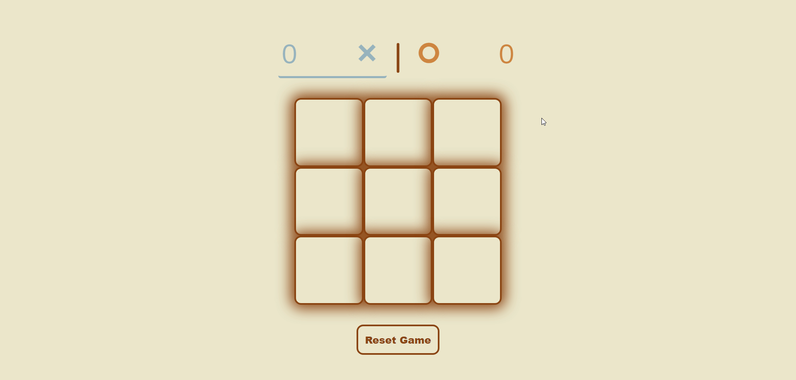
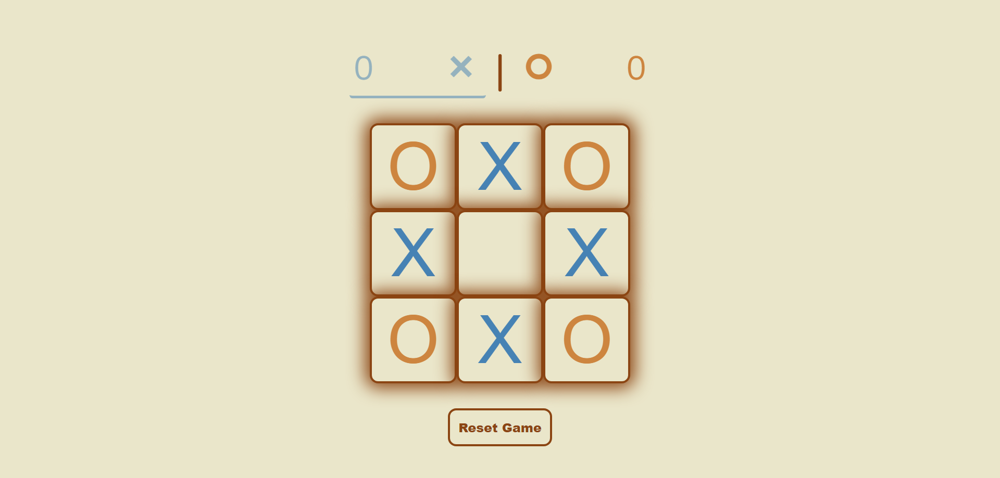

# Project: Tic Tac Toe

## Overview

I've created a Tic Tac Toe game using JavaScript, HTML, and CSS where two players take turns placing X and O marks on a 3x3 grid. This project helped me learn JavaScript module pattern for game logic. It has a user-friendly interface and clear feedback on game outcomes, making it fun to play and easy to understand. This sets a good base for adding more features in the future.

[Tic Tac Toe](https://krig6.github.io/odin-tic-tac-toe/)tally addictive!

## Sample

## Technologies Used

- HTML: Defines the structure and layout of the user interface.
- CSS: Shapes the look and feel of the website, arranging elements, selecting colors and fonts, and implementing fluid animations to enhance the user interface.
- JavaScript: Implements the JavaScript module pattern for game logic and factory function.

## Features

- Supports 2-player gameplay
- Score tracking functionality
- Loading animations at game start
- End-of-round message overlays
- Animated transitions for message overlays
- Click prevention during loading and message overlays for consistent user experience
- Reset button for clearing the game board and scores
- Hover effects on grid cells
- Animated player turn indicators

## Learning Path

This project has been the most challenging for me, especially working with the JavaScript module pattern. Starting out, I found it particularly intimidating. However, as I immersed myself deeper into the project, things gradually became more manageable. Even with limited experience in JavaScript, I managed to expand the project significantly by incorporating more functions for game logic, and adding animations. Through trial and error, new ideas emerged, which I actively implemented to the best of my ability.

Naturally, challenges arose along the way. I encountered visual bugs, such as a faint square appearing around the end-of-game message and animation issues when closing overlays. Despite these obstacles, overcoming them was immensely rewarding. Each problem-solving experience enhanced my skills and refined my approach to coding. Now, armed with greater knowledge and experience in JavaScript, I know I'm better prepared for future projects.

## Future Enhancements

- Implementing local storage
- Adding an AI player feature
- Incorporating sound effects
- Enhancing responsive design
- Introducing game statistics
- Implementing theme selection

## Acknowledgments

- [The Odin Project](https://www.theodinproject.com/) 
- [Google Fonts](https://fonts.google.com/) 
- [Boxicons](https://boxicons.com/) 
- [Flaticon](https://www.flaticon.com/)
